# Palo Alto Firewall – Deployment Methods Lab

Hands-on lab documenting the four traffic-facing deployment modes on a Palo Alto NGFW: **TAP**, **Virtual Wire**, **Layer 2**, and **Layer 3 (Sub-interface)** — all built on a single topology so the differences between modes are easy to compare directly. This is a companion piece to my [Palo Alto App-ID Project](#).

## Table of Contents
- [Lab Environment](#lab-environment)
- [Lab Topology](#lab-topology)
- [1. TAP Mode](#1-tap-mode)
- [2. Virtual Wire](#2-virtual-wire)
- [3. Layer 2 Deployment](#3-layer-2-deployment)
- [4. Layer 3 / Sub-interface Deployment](#4-layer-3--sub-interface-deployment)
- [Deployment Mode Comparison](#deployment-mode-comparison)
- [Lessons Learned](#lessons-learned)

## Lab Environment

| Component | Detail |
|---|---|
| Firewall | Palo Alto Networks VM-Series, PAN-OS 10.x |
| Switch | Cisco IOL (`i86bi_linux_l2-ipbasek9-ms.high_iron_aug9_2017b.bin`), emulated |
| Endpoints | Windows 10 VMs |
| Emulation | QEMU-based virtual lab (GNS3/EVE-NG style) |

All four deployment modes were configured **simultaneously** on the same firewall, each isolated to its own segment of the topology below, so a single lab build could demonstrate all four side by side.

## Lab Topology

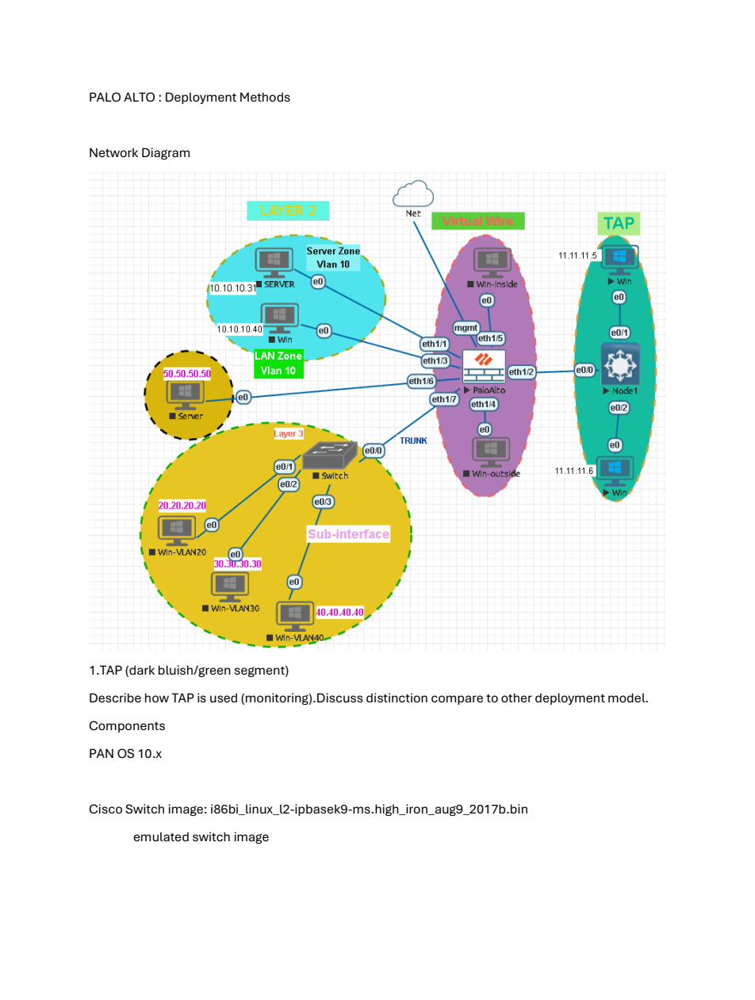

The topology has four independent segments, each mapped to one deployment mode:

| Segment (diagram color) | Deployment Mode | Addressing |
|---|---|---|
| Green — right | TAP | `11.11.11.5` / `11.11.11.6` |
| Purple — center | Virtual Wire | `22.22.22.x` (inside/outside) |
| Cyan — left | Layer 2 | `10.10.10.x` (Server/LAN, VLAN 10) |
| Yellow — bottom | Layer 3 Sub-interface | VLAN 20 / 30 / 40 → Server `50.50.50.50` |

> Note: `50.50.50.50` (black dashed circle, connected via `eth1/6`) sits outside the four colored zones on the diagram — it's simply the target server used to test routed reachability from VLAN 20/30/40 in the Sub-interface section below, not a separate deployment mode.

---

## 1. TAP Mode

**Concept:** TAP mode connects a firewall interface to a switch **SPAN (mirror) port**. The firewall receives a copy of the traffic passively — it never sits in the traffic path, so it cannot block, drop, or modify anything. It's used purely for visibility: App-ID, User-ID, threat, and content identification on live traffic without any risk to production flow.

**How it differs from the other modes:** every other mode below is inline (traffic actually passes through the firewall); TAP is out-of-band. This makes it the safest way to evaluate what a firewall *would* see/do before committing to an inline deployment.

**Components**
- PAN-OS 10.x, interface type set to `Tap`
- Cisco switch configured with a SPAN session mirroring both endpoint ports to the firewall-facing port

**Switch SPAN configuration**
```
interface Ethernet0/0
 description TAP MODE to PAN
 switchport mode access
!
interface Ethernet0/1
 description WIN10-endpoint1
 switchport mode access
 spanning-tree portfast edge
!
interface Ethernet0/2
 description WIN10-endpoint2
 switchport mode access
 spanning-tree portfast edge
!
monitor session 1 source interface Et0/1 - 2
monitor session 1 destination interface Et0/0
```

**Firewall interface configuration**

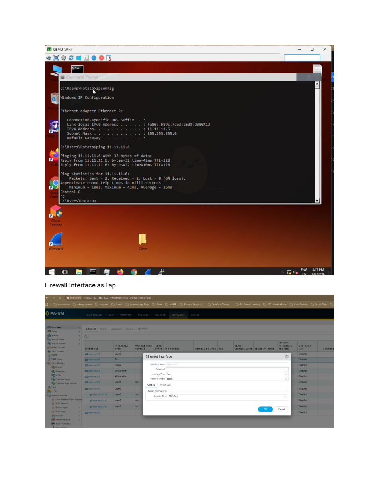

Interface type is set to `Tap` and assigned to a `TAP Zone` — note there's no IP address, virtual router, or virtual wire pairing, since the firewall isn't actually in the path.

**Verification**

Endpoint-to-endpoint connectivity (unaffected by the firewall, since it's only observing):

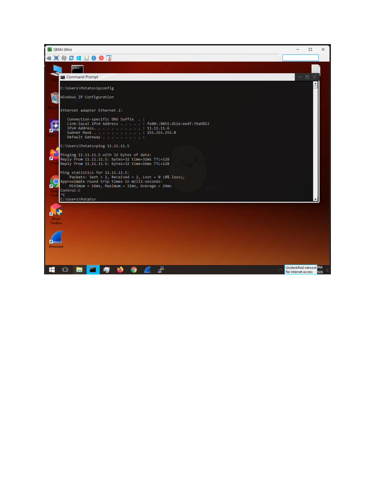

Security policy and traffic log confirming the mirrored traffic is visible to the firewall, with App-ID correctly identifying RDP, SMB, and ICMP:

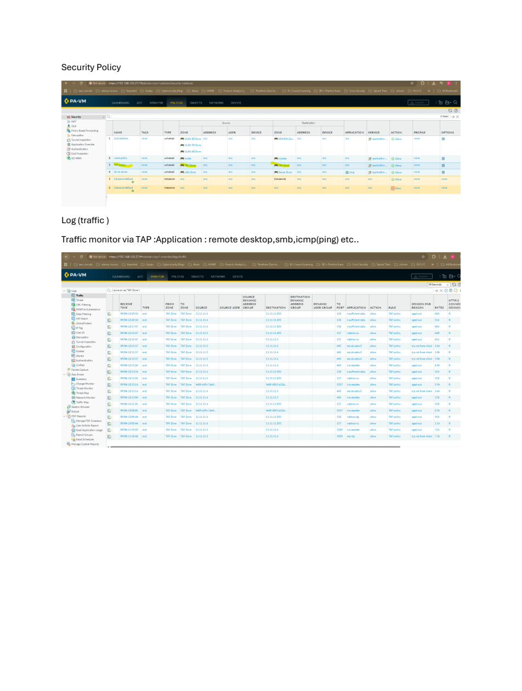

**Takeaway:** TAP is the right first step for any greenfield deployment — it lets you validate App-ID/threat visibility and build accurate security policies from real traffic *before* going inline, with zero risk of an outage.

---

## 2. Virtual Wire

**Concept:** Virtual Wire ("vWire") binds two firewall interfaces together as a logical wire — the firewall is inline ("bump in the wire") but transparent at Layer 3: no new IP subnet, no re-addressing, no routing changes to the existing network. It still applies Layer 7 inspection and can enforce (allow/deny) traffic, unlike TAP.

**How it differs from the other modes:** it's the fastest way to go inline without touching existing IP design — useful for retrofitting a firewall into a network that's already built. Compare to Layer 2/3 modes below, which require the firewall to actively participate in switching or routing.

**Components**
- 2 endpoints (Windows 10)
- PA-VM sitting logically between the two endpoints

**Zone and interface configuration**

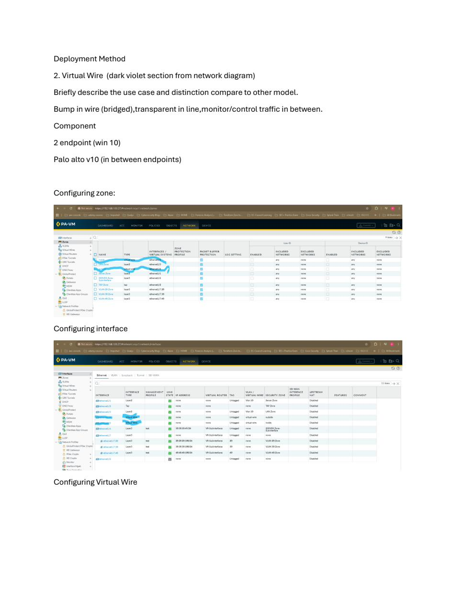

Two interfaces (`ethernet1/4`, `ethernet1/5`) are set to type `Virtual Wire` and mapped to `inside` and `outside` zones respectively.

**Virtual wire pairing and security policy**

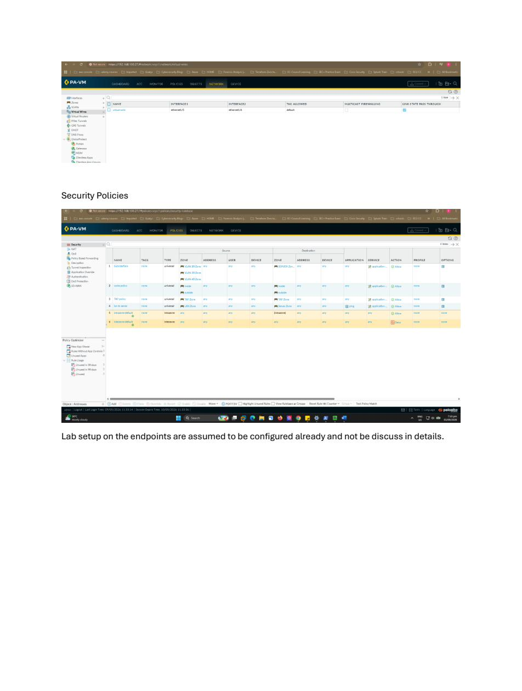

The two interfaces are explicitly paired under **Network > Virtual Wires**, with a security policy allowing traffic between the `inside` and `outside` zones.

**Verification**

ICMP:
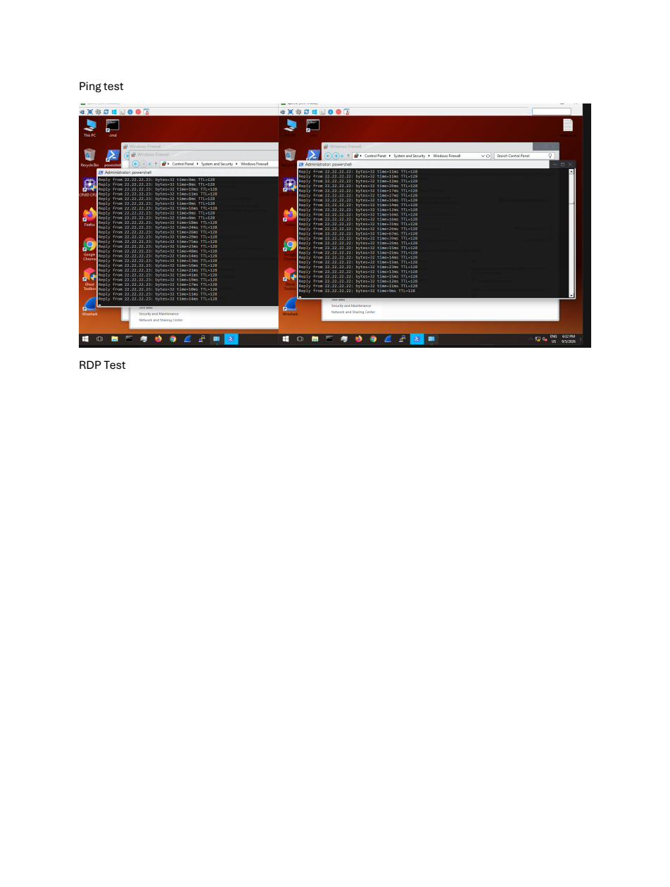

RDP:
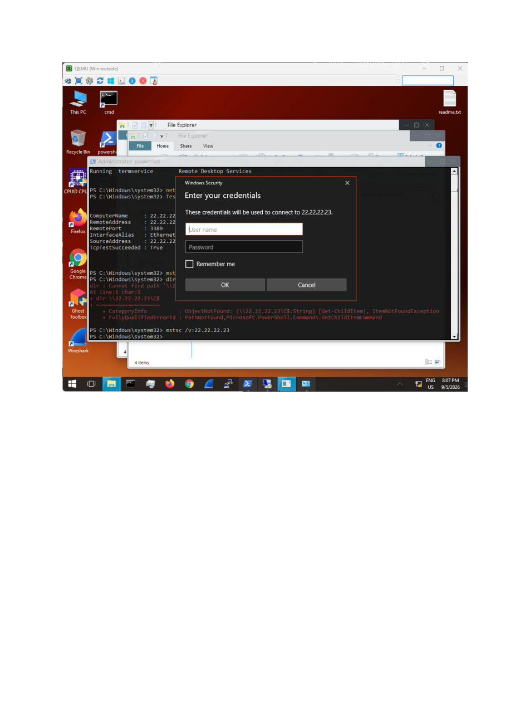

SMB / port reachability (`Test-NetConnection` on port 3389 shown succeeding — this stands in for the SMB port test in this lab run):
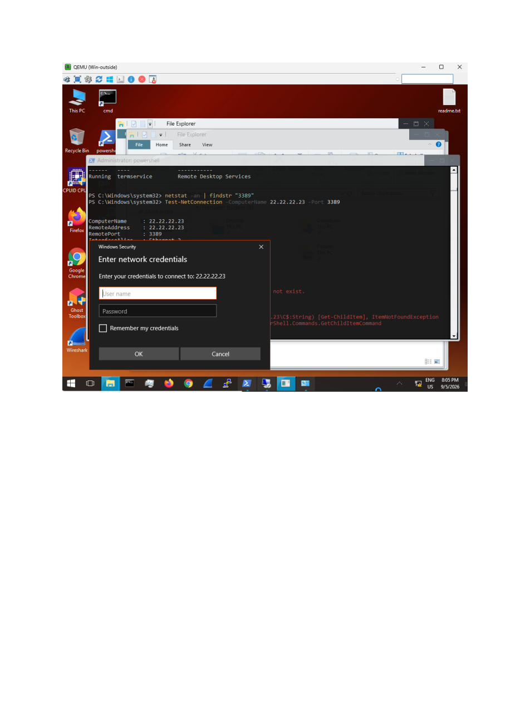

Traffic logs confirming the firewall is inspecting and logging each session inline:
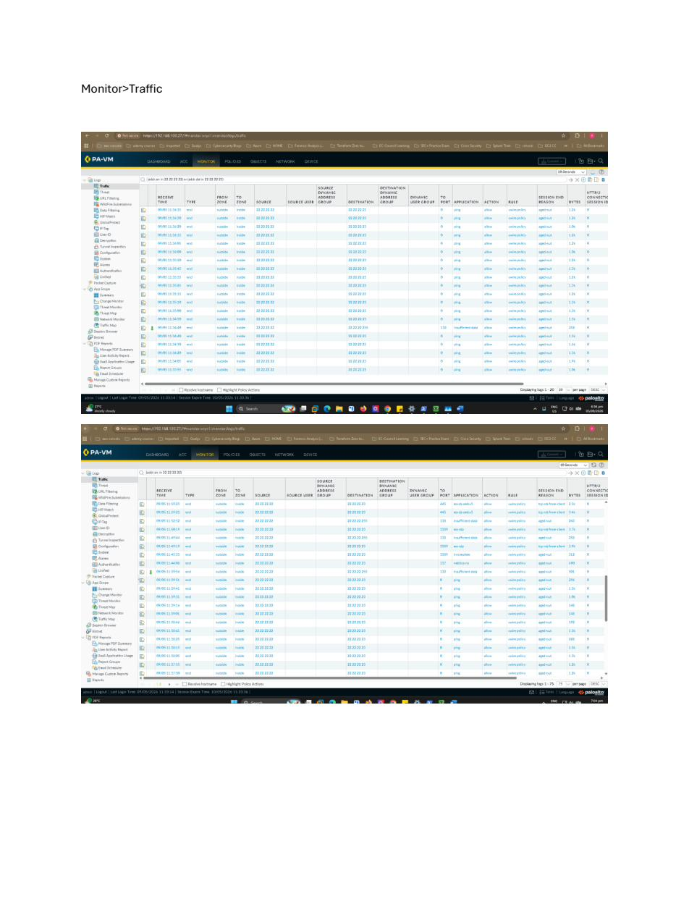

**Takeaway:** Virtual Wire is the "drop-in" option — zero re-architecture, but you inherit whatever the existing L2/L3 design already looks like on either side. It's a great migration path from a non-firewalled segment to a fully-routed Layer 3 firewall later.

---

## 3. Layer 2 Deployment

**Concept:** In Layer 2 mode, firewall interfaces act like switch ports — they belong to VLANs and forward based on MAC address, not IP. The firewall replaces (or sits alongside) a Layer 2 switch, letting it apply security policy *between VLANs* while still functioning as a transparent switch at Layer 3 — no virtual router is needed since routing isn't happening on the firewall.

**Interface, zone, and VLAN configuration**

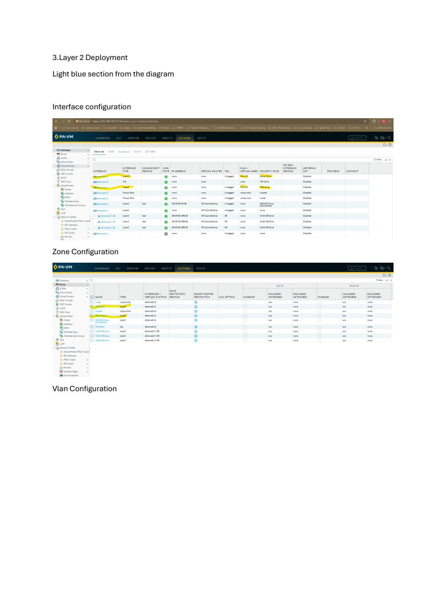

- `ethernet1/1` → `Layer2`, VLAN 10, `Server Zone`
- `ethernet1/3` → `Layer2`, VLAN 10, `LAN Zone`
- Both interfaces are tied together under **Network > VLANs** (`Vlan 10`) — this is what makes them behave as one switched broadcast domain through the firewall.

> No Virtual Router is configured for this mode — Layer 2 forwarding doesn't require one.

**Security policy and test result**

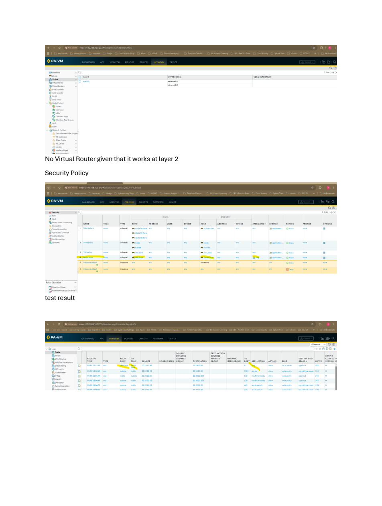

A policy allows `LAN Zone → Server Zone` (ICMP/application traffic), and the traffic log confirms the `lan-to-server` rule matching and permitting the session.

**Takeaway:** Layer 2 mode is the right fit when you want to insert policy enforcement between VLANs without introducing a routing hop — the network keeps its existing IP scheme and gateway, and the firewall just becomes a smarter, policy-aware switch for that broadcast domain.

---

## 4. Layer 3 / Sub-interface Deployment

**Concept:** This is full Layer 3 routing: a single physical trunk interface is carved into tagged VLAN sub-interfaces (802.1Q), each with its own IP address, zone, and entry in a Virtual Router. The firewall now performs actual inter-VLAN routing in addition to policy enforcement — this is the mode used when the firewall is meant to *replace* a router/L3 switch, not just sit next to one.

**Switch trunk/access configuration**

```
interface Ethernet0/0
 description UPLINK TO PAN
 switchport trunk allowed vlan 20,30,40
 switchport trunk encapsulation dot1q
 switchport mode trunk
!
interface Ethernet0/1
 description ACCESS-VLAN 20
 switchport access vlan 20
 switchport mode access
 spanning-tree portfast
!
interface Ethernet0/2
 description ACCESS-VLAN 30
 switchport access vlan 30
 switchport mode access
 spanning-tree portfast
!
interface Ethernet0/3
 description ACCESS-VLAN 40
 switchport access vlan 40
 switchport mode access
 spanning-tree portfast
```

**Firewall switch port / zone configuration**

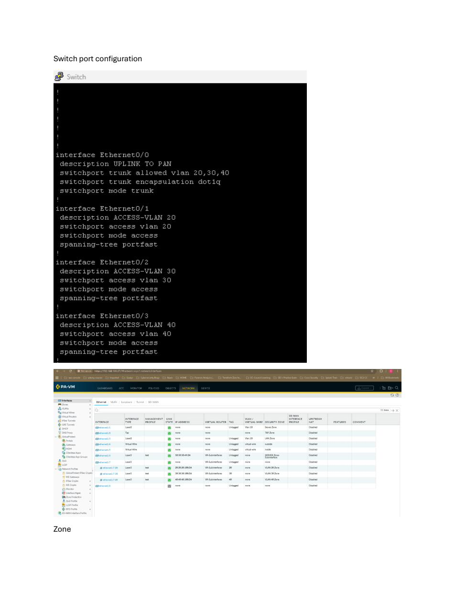

Each VLAN gets its own sub-interface (`ethernet1/7.20`, `.30`, `.40`), tagged accordingly, each assigned to a `VR-Subinterfaces` zone.

**Virtual Router and security policy**

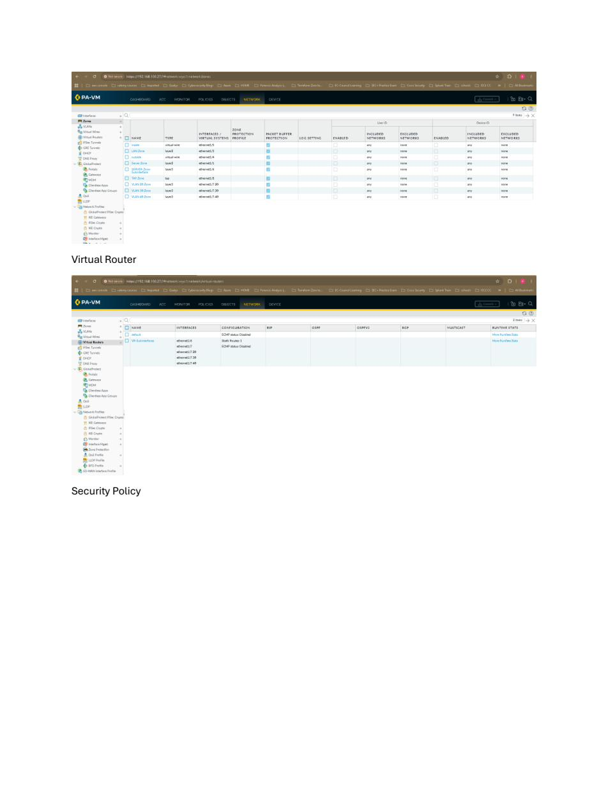

All three sub-interfaces are added to a dedicated Virtual Router (`VR-Subinterfaces`) so the firewall can actively route between VLAN 20/30/40 and the server segment. A security policy permits traffic from all three VLAN zones to the `Server Zone`.

**Verification**

VLAN 20 → Server (`50.50.50.50`):
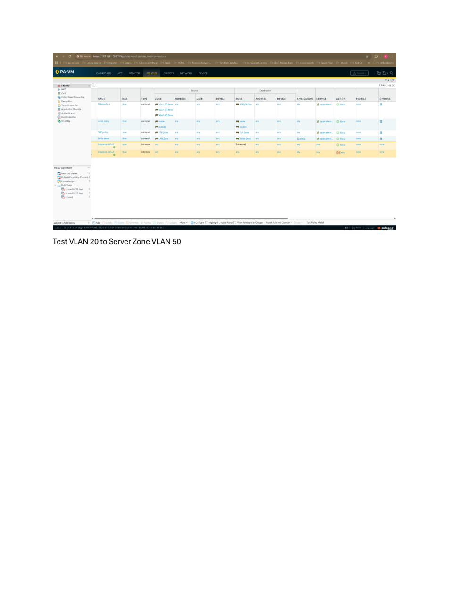
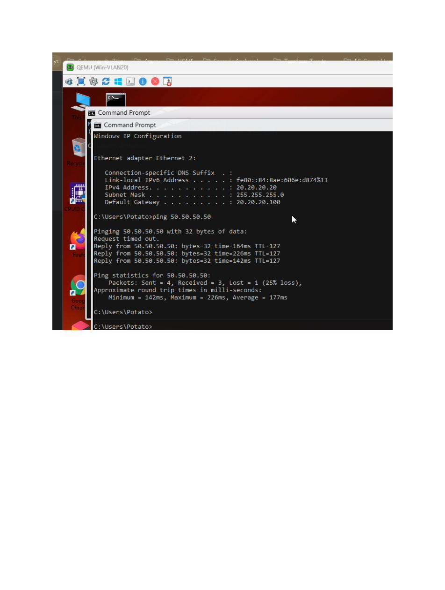

VLAN 30 → Server:
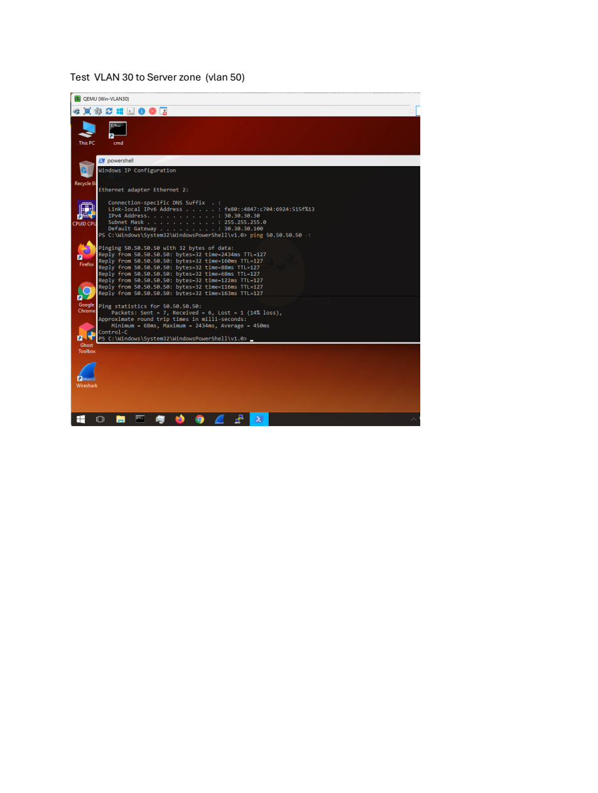

VLAN 40 → Server:
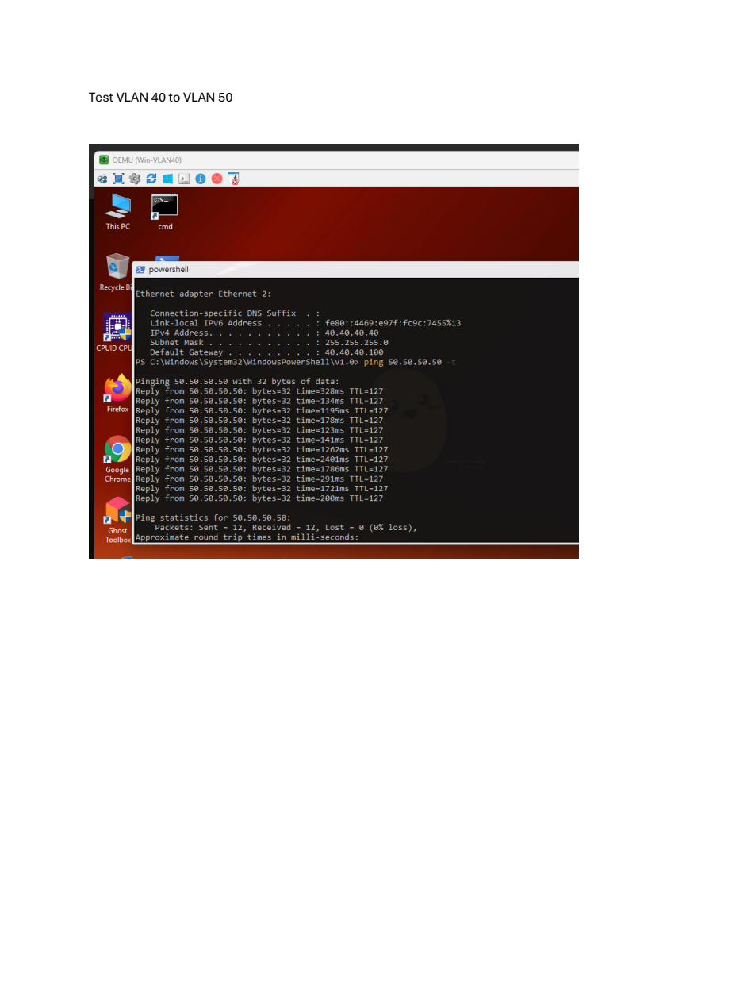

**Traffic log confirmation** — all three VLANs (20/30/40) hitting the `50.50.50.50` server through the `Subinterface` rule, plus the earlier Layer 2 `lan to server` rule for comparison:

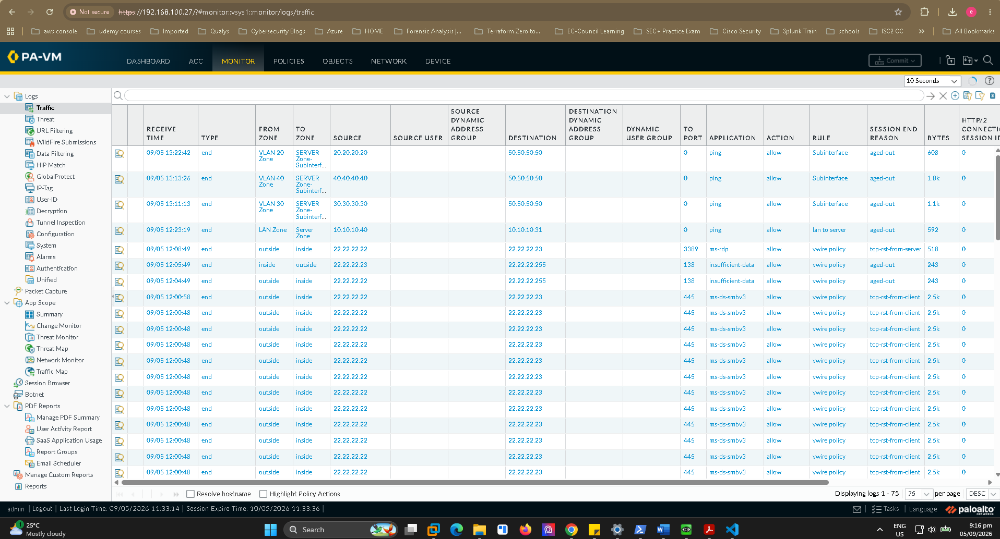

This is the clearest evidence of the routing actually happening: each VLAN's ping is logged with `Action: allow` and `Rule: Subinterface`, confirming the Virtual Router is correctly forwarding traffic between the VLAN sub-interfaces and the server zone — not just that ICMP succeeded at the endpoint.

> Note: the first ping(s) in each VLAN 20/30 test show a small amount of loss/high latency (e.g. "25% loss", first RTT in the seconds) — this is expected ARP resolution delay on the first packet after the sub-interface path is first used, not a policy or routing issue. Subsequent packets return to normal latency.

**Takeaway:** Sub-interface mode is the most "production-like" of the four — it's how you'd actually deploy a firewall as your inter-VLAN router in a real network. It's also the only mode here that required a Virtual Router, since it's the only one doing real Layer 3 forwarding.

---

## Deployment Mode Comparison

| Mode | OSI Layer | IP on FW Interface? | Virtual Router Needed? | Inline (can block traffic)? | Typical Use Case |
|---|---|---|---|---|---|
| **TAP** | N/A (passive) | No | No | No | Visibility-only: validate App-ID/threat detection before going inline |
| **Virtual Wire** | Layer 1 (transparent) | No | No | Yes | Drop-in inline enforcement with zero re-addressing |
| **Layer 2** | Layer 2 | No (VLAN-based) | No | Yes | Inter-VLAN policy enforcement without adding a routing hop |
| **Layer 3 (Sub-interface)** | Layer 3 | Yes | Yes | Yes | Firewall acts as the inter-VLAN router, full routing + policy |

## Lessons Learned

- **TAP is the safest starting point** for any new deployment — it validates what your App-ID/security policy would actually match before you risk breaking production traffic.
- **Virtual Wire vs. Layer 2** both avoid re-IP'ing the network, but Layer 2 requires you to actually place interfaces into VLANs/zones on the firewall, while Virtual Wire just pairs two interfaces as a transparent bridge — Layer 2 is the better fit when you have more than two segments to manage.
- **Sub-interface mode is the only one that needs a Virtual Router**, because it's the only mode where the firewall is genuinely making routing decisions rather than switching or bridging.
- Testing with `ping`, RDP, and SMB across each mode was a good way to confirm both **connectivity** and **policy match** (via Monitor > Traffic) independently — a session can succeed at the network level while still being logged/denied at the policy level, so checking both matters.

## Repository Structure

```
.
├── README.md
└── images/
    ├── 01-network-diagram.jpeg
    ├── 02-tap-ping-endpoint2-to-endpoint1.jpeg
    ├── 03-tap-ping-endpoint1-and-interface-config.jpeg
    ├── 04-tap-security-policy-and-traffic-log.jpeg
    ├── 05-vwire-zone-and-interface-config.jpeg
    ├── 06-vwire-config-and-security-policy.jpeg
    ├── 07-vwire-ping-test.jpeg
    ├── 08-vwire-rdp-test.jpeg
    ├── 09-vwire-smb-connectivity-test.jpeg
    ├── 10-vwire-traffic-logs.jpeg
    ├── 11-l2-interface-zone-vlan-config.jpeg
    ├── 12-l2-vlan-securitypolicy-testresult.jpeg
    ├── 13-subif-switchport-config-and-zone.jpeg
    ├── 14-subif-virtualrouter-and-securitypolicy.jpeg
    ├── 15-subif-test-vlan20-to-server.jpeg
    ├── 16-subif-test-vlan20-ping-result.jpeg
    ├── 17-subif-test-vlan30-to-server.jpeg
    ├── 18-subif-test-vlan40-to-server.jpeg
    └── 19-subif-traffic-log-all-vlans.png
```
