# Palo Alto Firewall – Deployment Methods Lab

Hands-on lab documenting the four traffic-facing deployment modes on a Palo Alto NGFW: **TAP**, **Virtual Wire**, **Layer 2**, and **Layer 3 (Sub-interface)** — all built on a single topology so the differences between modes are easy to compare directly. This is a companion piece to my [Palo Alto App-ID Project](#).

## Table of Contents
- [Lab Environment](#lab-environment)
- [Lab Topology](#lab-topology)
- [1. TAP Mode](#1-tap-mode)
- [2. Virtual Wire](#2-virtual-wire)
- [3. Layer 2 Deployment](#3-layer-2-deployment)
- [4. Layer 3 / Sub-interface Deployment](#4-layer-3--sub-interface-deployment)
- [Deployment Mode Comparison](#deployment-mode-comparison)
- [Lessons Learned](#lessons-learned)
- [Repository Structure](#repository-structure)

## Lab Environment

| Component | Detail |
|---|---|
| Firewall | Palo Alto Networks VM-Series, PAN-OS 10.x (unlicensed) |
| Switch | Cisco IOL (`i86bi_linux_l2-ipbasek9-ms.high_iron_aug9_2017b.bin`), emulated |
| Endpoints | Windows 10 VMs |
| Emulation | QEMU-based virtual lab (EVE-NG) |

All four deployment modes were configured **simultaneously** on the same firewall, each isolated to its own segment of the topology below, so a single lab build could demonstrate all four side by side — and be compared against each other directly rather than rebuilt from scratch per mode.

## Lab Topology

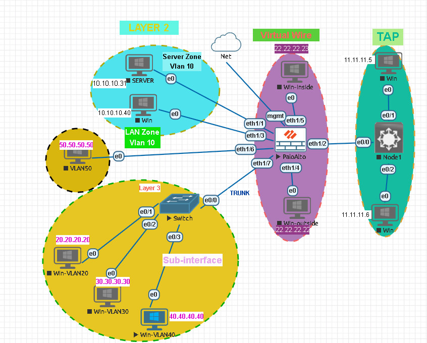

The topology has four independent segments, each mapped to one deployment mode:

| Segment (diagram color) | Deployment Mode | Addressing |
|---|---|---|
| Green — right | TAP | `11.11.11.5` / `11.11.11.6` |
| Purple — center | Virtual Wire | `22.22.22.x` (inside/outside) |
| Cyan — left | Layer 2 | `10.10.10.x` (Server/LAN, VLAN 10) |
| Yellow — bottom | Layer 3 Sub-interface | VLAN 20 / 30 / 40 → Server `50.50.50.50` |

> Note: `50.50.50.50` (black dashed circle, connected via `eth1/6`) sits outside the four colored zones on the diagram — it's simply the target server used to test routed reachability from VLAN 20/30/40 in the Sub-interface section below, not a separate deployment mode.

---

## 1. TAP Mode

**Concept:** TAP mode connects a firewall interface to a switch **SPAN (mirror) port**. The firewall receives a copy of the traffic passively — it never sits in the traffic path, so it cannot block, drop, or modify anything. It's used purely for visibility: App-ID, User-ID, threat, and content identification on live traffic without any risk to production flow.

**How it differs from the other modes:** every other mode below is inline (traffic actually passes through the firewall); TAP is out-of-band. This makes it the safest way to evaluate what a firewall *would* see/do before committing to an inline deployment.

**Components**
- PAN-OS 10.x, interface type set to `Tap`
- Cisco switch configured with a SPAN session mirroring both endpoint ports to the firewall-facing port

**Switch SPAN configuration**
```
interface Ethernet0/0
 description TAP MODE to PAN
 switchport mode access
!
interface Ethernet0/1
 description WIN10-endpoint1
 switchport mode access
 spanning-tree portfast edge
!
interface Ethernet0/2
 description WIN10-endpoint2
 switchport mode access
 spanning-tree portfast edge
!
monitor session 1 source interface Et0/1 - 2
monitor session 1 destination interface Et0/0
```

**Firewall interface configuration**

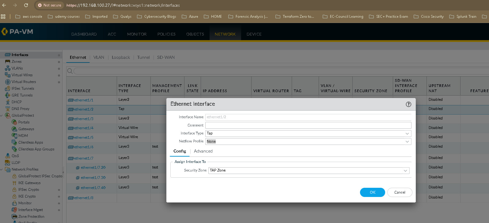

Interface type is set to `Tap` and assigned to a `TAP Zone` — note there's no IP address, virtual router, or virtual wire pairing, since the firewall isn't actually in the path.

**Verification**

Ping from Endpoint 2 to Endpoint 1:
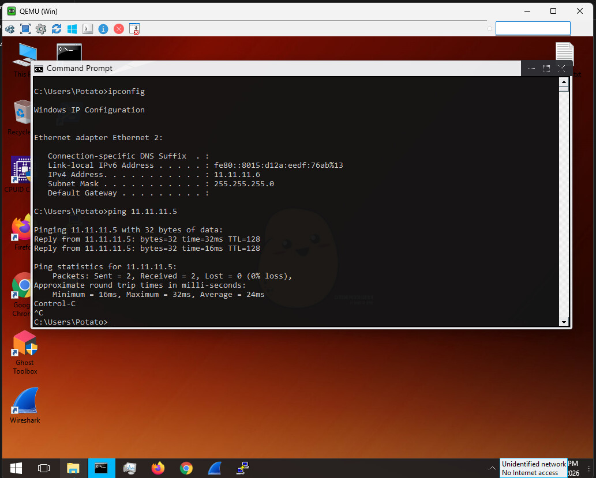

Ping from Endpoint 1 to Endpoint 2:
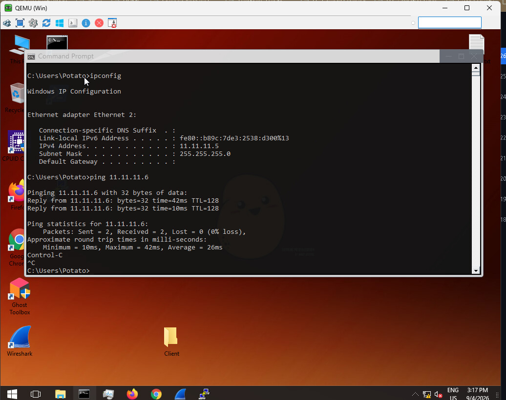

Both directions complete with 0% loss — this just confirms the underlying switched path is healthy before checking whether the firewall actually *saw* any of it.

**Security policy**

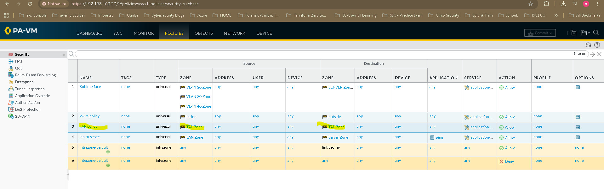

A universal `TAP policy` (TAP Zone → TAP Zone, any application, allow) exists purely so the firewall logs what it observes — TAP mode has no enforcement to configure.

**Traffic log outcome**

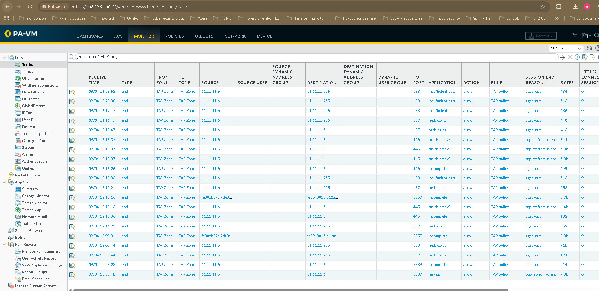

The **Monitor > Traffic** log, filtered on `zone.src eq 'TAP Zone'`, is the real proof this mode is working: it shows a stream of sessions between `11.11.11.5` and `11.11.11.6` with App-ID correctly resolving `ms-rdp` (port 3389), `ms-ds-smbv3` (port 445), and `netbios-ns`/`netbios-dg` broadcast traffic, all matched to `TAP policy` and marked `allow` — with a mix of `aged-out` and `tcp-rst-from-client` session end reasons visible across the entries. Since TAP can't block anything, "allow" here really just means "seen and classified" — the value is entirely in the visibility, not the enforcement.

**Takeaway:** TAP is the right first step for any greenfield deployment — it lets you validate App-ID/threat visibility and build accurate security policies from real traffic *before* going inline, with zero risk of an outage.

---

## 2. Virtual Wire

**Concept:** Virtual Wire ("vWire") binds two firewall interfaces together as a logical wire — the firewall is inline ("bump in the wire") but transparent at Layer 3: no new IP subnet, no re-addressing, no routing changes to the existing network. It still applies Layer 7 inspection and can enforce (allow/deny) traffic, unlike TAP.

**How it differs from the other modes:** it's the fastest way to go inline without touching existing IP design — useful for retrofitting a firewall into a network that's already built. Compare to Layer 2/3 modes below, which require the firewall to actively participate in switching or routing.

**Components**
- 2 endpoints (Windows 10)
- PA-VM sitting logically between the two endpoints

**Zone configuration**

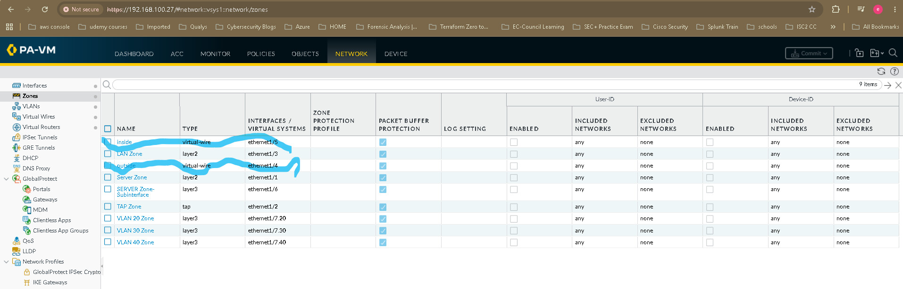

`inside` and `outside` are shown as `virtual-wire` type zones, mapped to `ethernet1/5` and `ethernet1/4` respectively.

**Interface configuration**

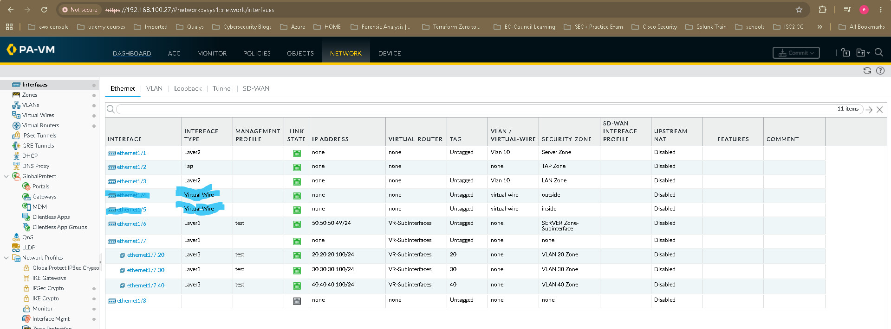

The interface table confirms `ethernet1/4` and `ethernet1/5` have Interface Type = `Virtual Wire`, with no IP address or virtual router assigned — traffic passes through transparently based on zone policy alone.

**Virtual wire pairing**

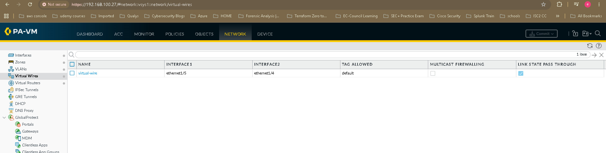

The two interfaces are explicitly paired under **Network > Virtual Wires**, with **Link State Pass Through** enabled so that if one side goes down, the other reflects it — mimicking a physical inline cable.

**Security policy**

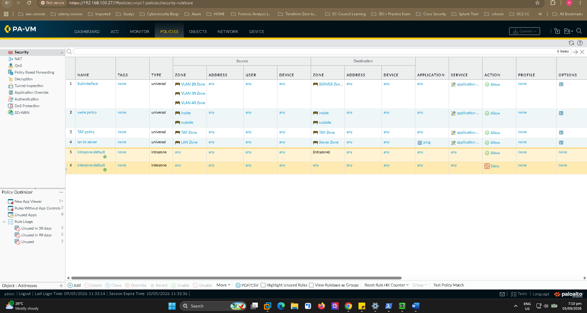

The `vwire policy` rule permits traffic between the `inside` and `outside` zones for any application. Note it sits **below** the `Subinterface` rule in the rulebase — more on why that ordering matters in [Lessons Learned](#lessons-learned).

**Verification**

ICMP — continuous replies between `22.22.22.22` and `22.22.22.23` confirm uninterrupted Layer 3 connectivity straight through the wire:
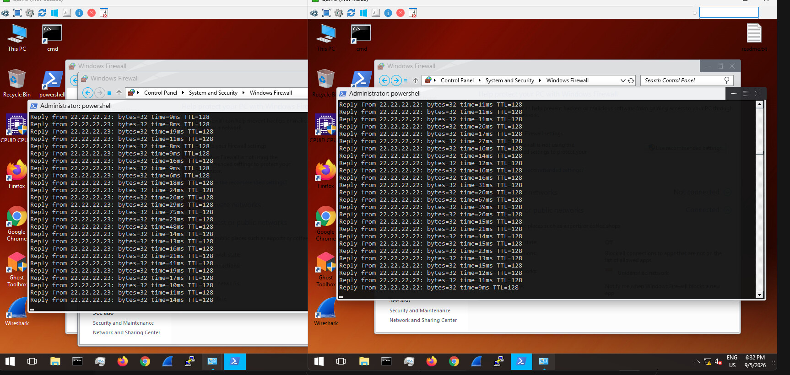

RDP — a TCP test to port 3389 succeeds (`TcpTestSucceeded: True`) and the Windows RDP credential prompt appears, confirming the vWire policy permits RDP:
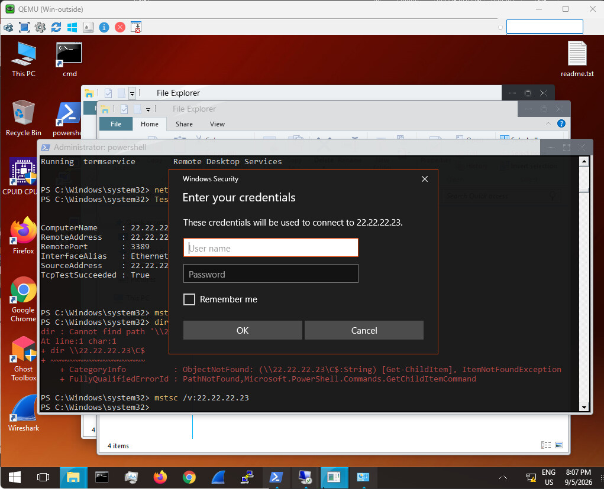

SMB / port reachability — a second `Test-NetConnection` on port 3389 succeeds and prompts for network credentials, confirming the connection-oriented test path also completes cleanly through the wire:
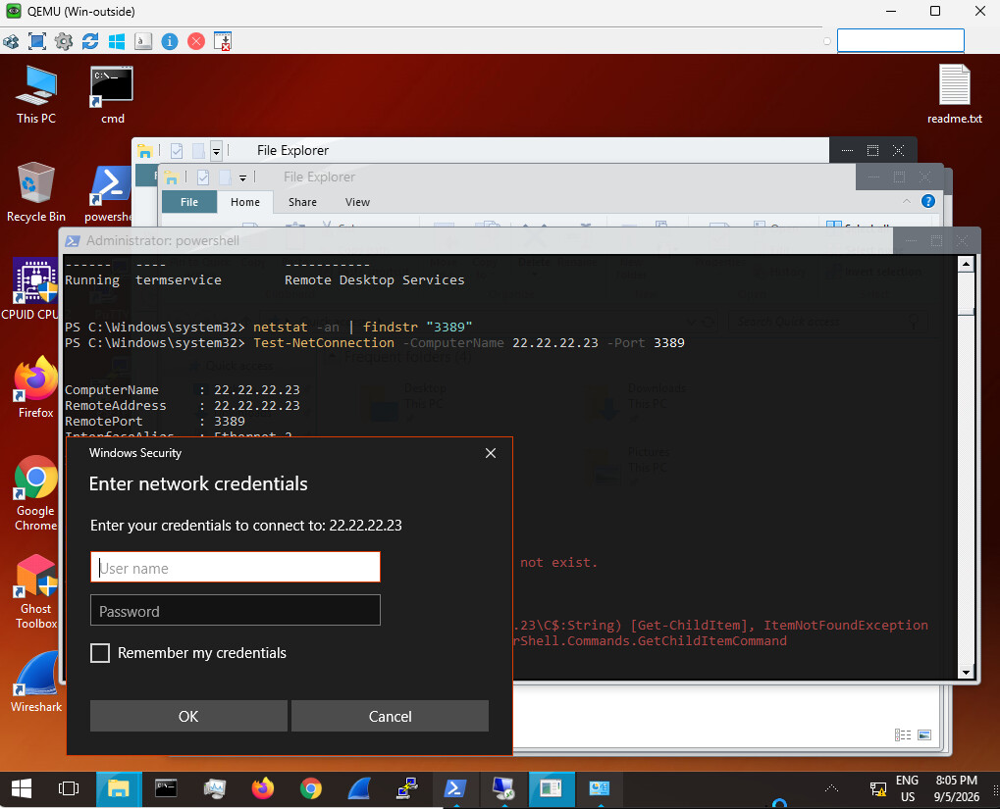

**Traffic log outcome**

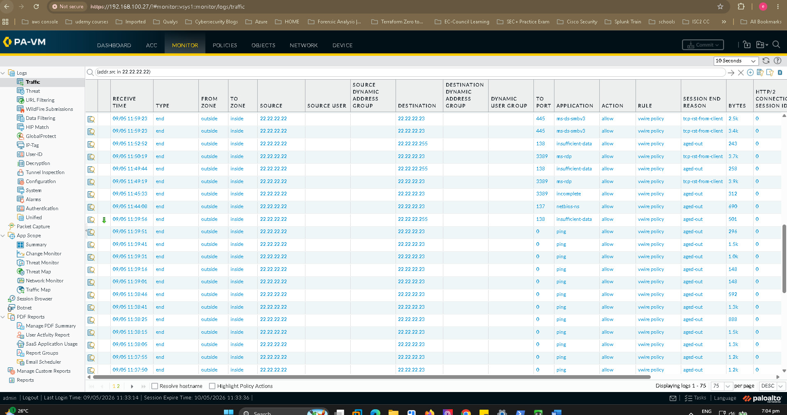

This is the key evidence for Virtual Wire: sessions between `22.22.22.22` and `22.22.22.23` are logged against the `vwire policy` rule, and the **Application** column correctly resolves `ms-ds-smbv3`, `ms-rdp`, and `ping` — not just generic IP/TCP traffic. It confirms that even with zero IP configuration of its own, the firewall's App-ID engine is still fully inspecting Layer 7 content as it passes the traffic through inline, and it's actually enforcing policy (not just observing, like TAP).

**Takeaway:** Virtual Wire is the "drop-in" option — zero re-architecture, but you inherit whatever the existing L2/L3 design already looks like on either side. It's a great migration path from a non-firewalled segment to a fully-routed Layer 3 firewall later.

---

## 3. Layer 2 Deployment

**Concept:** In Layer 2 mode, firewall interfaces act like switch ports — they belong to VLANs and forward based on MAC address, not IP. The firewall replaces (or sits alongside) a Layer 2 switch, letting it apply security policy *between VLANs* while still functioning as a transparent switch at Layer 3 — no virtual router is needed since routing isn't happening on the firewall.

**Interface configuration**

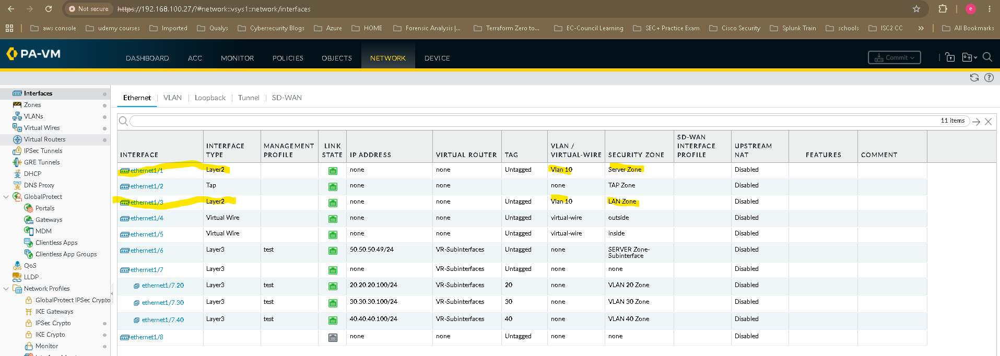

- `ethernet1/1` → `Layer2`, VLAN 10, `Server Zone`
- `ethernet1/3` → `Layer2`, VLAN 10, `LAN Zone`

**Zone configuration**

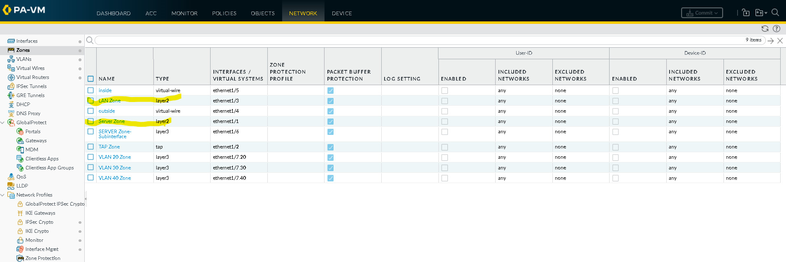

The Zones table confirms `LAN Zone` and `Server Zone` are both of type `layer2`, mapped to `ethernet1/3` and `ethernet1/1` respectively — this is what lets the firewall enforce policy between two hosts on the same VLAN.

**VLAN membership**

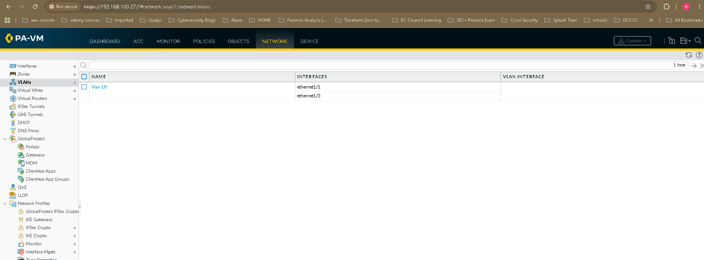

The VLAN object `Vlan 10` explicitly lists `ethernet1/1` and `ethernet1/3` as member interfaces, completing the Layer 2 bridge between the Server Zone and LAN Zone.

**Security policy**

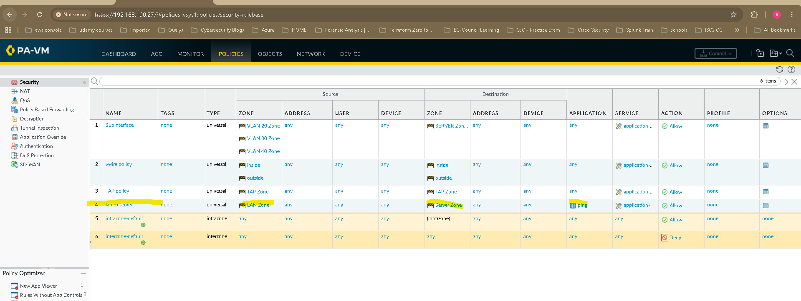

The `lan to server` rule permits traffic from the `LAN Zone` to the `Server Zone` with the application restricted specifically to `ping`, demonstrating granular application-based control even within a Layer 2 (switched) deployment.

**Traffic log outcome**

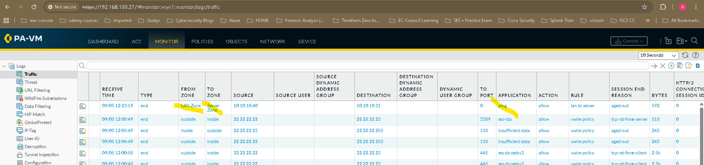

The traffic log confirms a session from `10.10.10.40` to `10.10.10.31`, matched to the `lan to server` rule, `From Zone: LAN Zone`, `To Zone: Server Zone`, `Application: ping`, `Action: allow`. This proves that Layer 2 zone separation and policy enforcement work correctly even though both hosts sit on the same VLAN and IP subnet.

**Takeaway:** Layer 2 mode is the right fit when you want to insert policy enforcement between VLANs without introducing a routing hop — the network keeps its existing IP scheme and gateway, and the firewall just becomes a smarter, policy-aware switch for that broadcast domain.

---

## 4. Layer 3 / Sub-interface Deployment

**Concept:** This is full Layer 3 routing: a single physical trunk interface is carved into tagged VLAN sub-interfaces (802.1Q), each with its own IP address, zone, and entry in a Virtual Router. The firewall now performs actual inter-VLAN routing in addition to policy enforcement — this is the mode used when the firewall is meant to *replace* a router/L3 switch, not just sit next to one.

**Cisco switch system info**

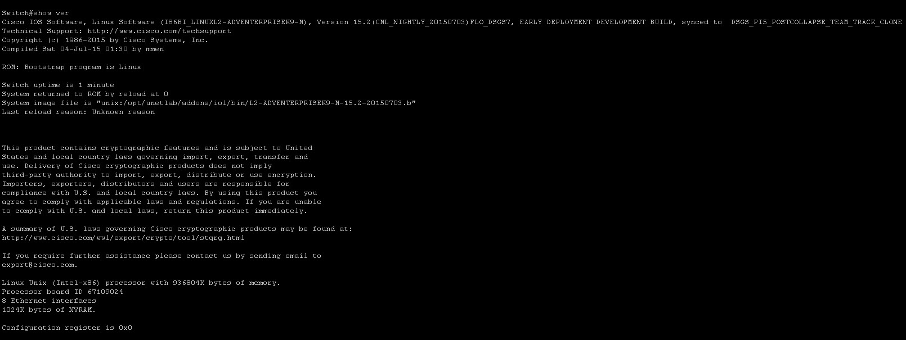

The `show ver` output confirms the emulated device is running Cisco IOS (`I86BI_LINUXL2-ADVENTERPRISEK9-M`) inside EVE-NG, providing the trunking and VLAN access-port functionality needed to feed traffic into the firewall's sub-interfaces.

**Switch trunk/access configuration**

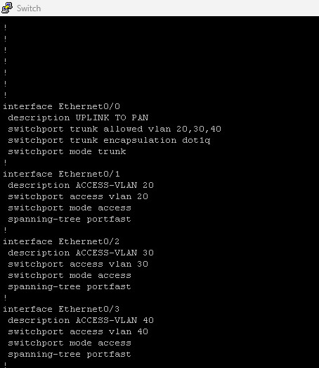

`Ethernet0/0` is configured as an 802.1Q trunk carrying VLANs 20, 30, and 40 up to the firewall (`UPLINK TO PAN`), while `Ethernet0/1`, `0/2`, and `0/3` are dedicated access ports for VLAN 20, 30, and 40 respectively — each connecting one of the Windows VLAN test endpoints.

**Firewall sub-interface configuration**

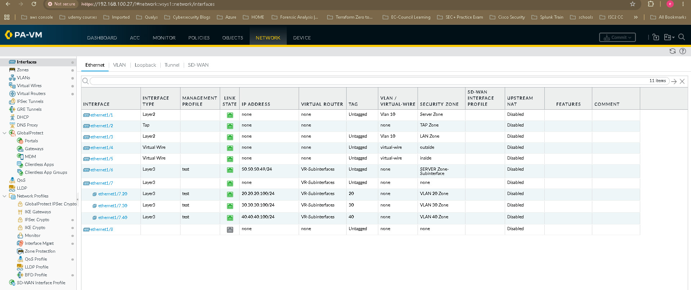

Each VLAN gets its own routed sub-interface — `ethernet1/7.20` (`20.20.20.100/24`), `.30` (`30.30.30.100/24`), `.40` (`40.40.40.100/24`) — each tagged to its matching VLAN ID and bound to its own security zone.

**Zone configuration**

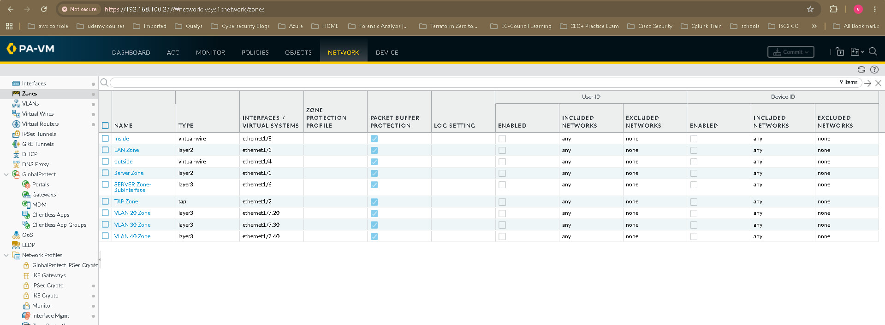

The Zones list shows `VLAN 20 Zone`, `VLAN 30 Zone`, and `VLAN 40 Zone` each bound to their respective `ethernet1/7` sub-interface, alongside the other zones built earlier in the lab (`inside`, `outside`, `LAN Zone`, `Server Zone`, `TAP Zone`) — confirming all four deployment modes coexist on the same firewall instance.

**Virtual Router**

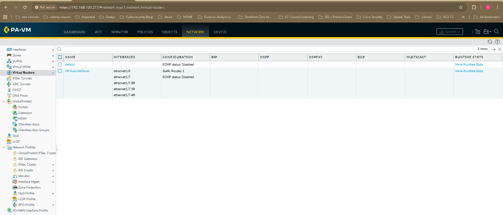

A dedicated virtual router, `VR-Subinterfaces`, is created containing `ethernet1/6` and all three `ethernet1/7` sub-interfaces, along with one static route — this is what allows traffic to actually be routed between VLAN 20/30/40 and the VLAN 50 server segment.

**Security policy**

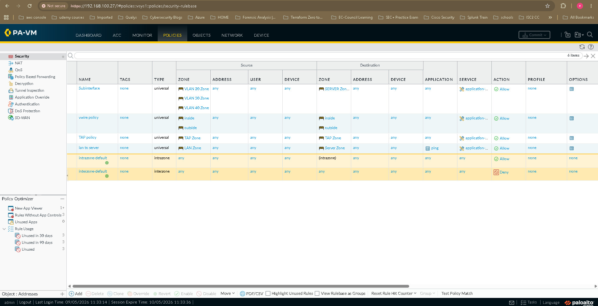

The `Subinterface` rule permits traffic from VLAN 20/30/40 zones to the Server Zone for any application, sitting at the **top** of the rulebase, above the Virtual Wire and TAP policies.

**Verification**

VLAN 20 → Server (`50.50.50.50`):
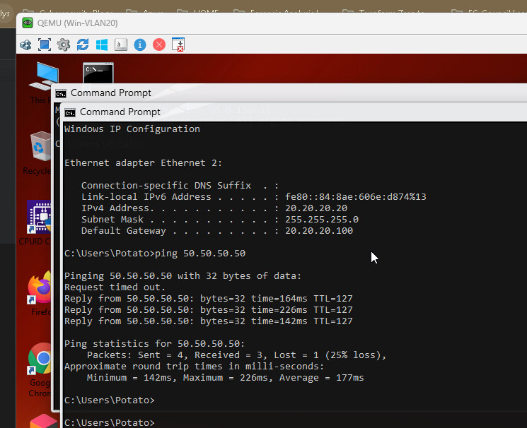

VLAN 30 → Server:
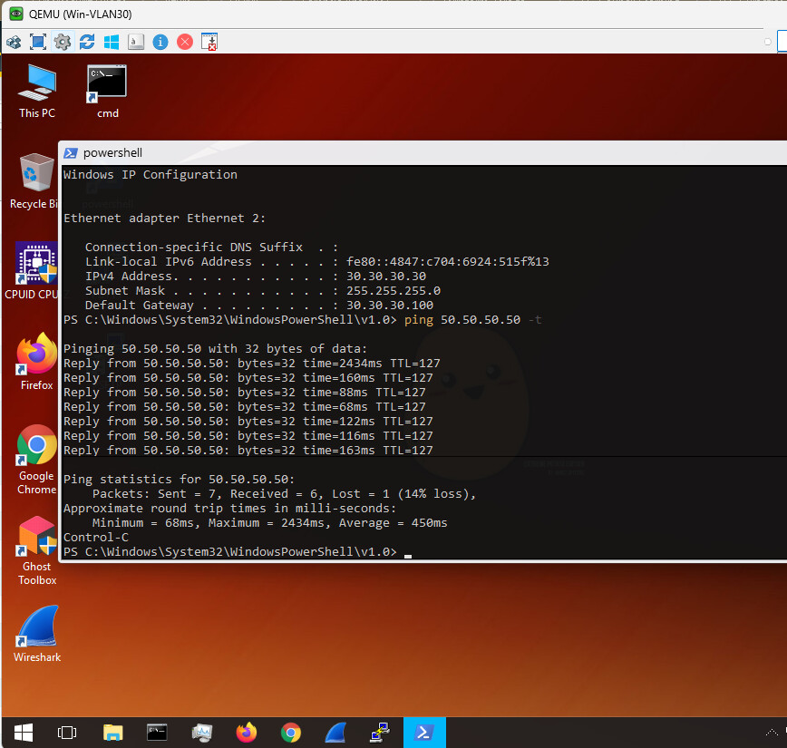

VLAN 40 → Server:
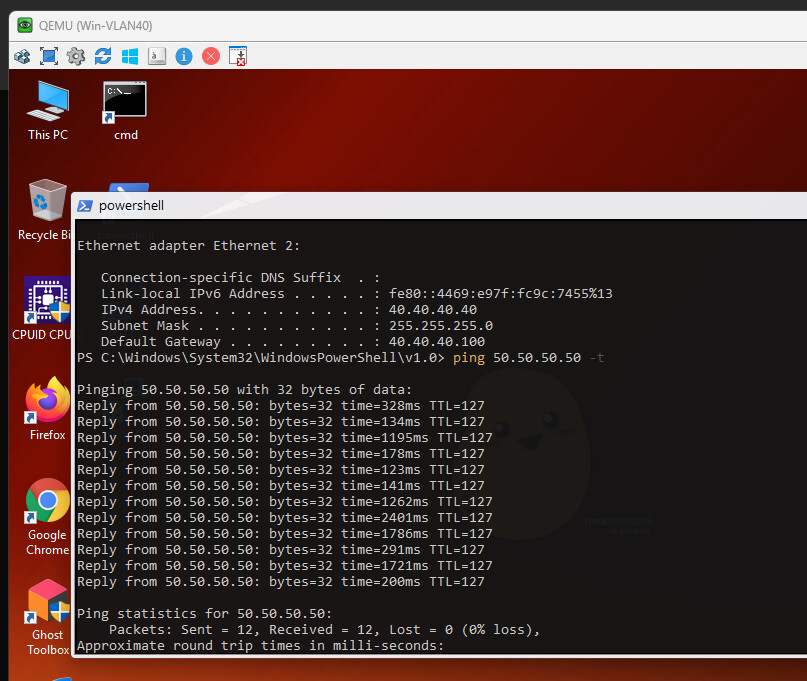

Each VLAN shows successful replies from `50.50.50.50`, confirming the Virtual Router is correctly routing between all three sub-interfaces and the server zone.

**Traffic log outcome**

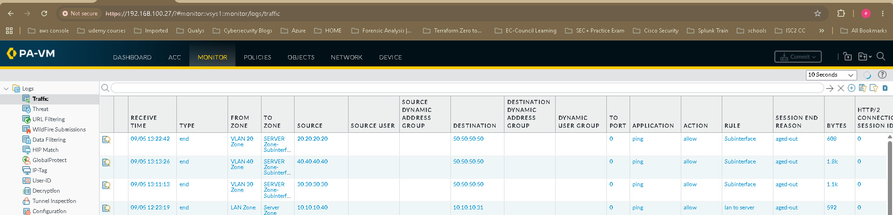

This is the clearest evidence of the routing actually happening: it shows three **separate** sessions — one each from the VLAN 20, VLAN 30, and VLAN 40 zones — all destined for `50.50.50.50` in the `Server Zone-Subinterface`, each matched to the `Subinterface` rule with `Application: ping` and `Action: allow`. Alongside the earlier Layer 2 `lan to server` entry, this single log view ties every deployment mode's policy hits together and confirms each VLAN's sub-interface is both routing correctly *and* being evaluated against the intended security rule — not just that ICMP happened to succeed at the endpoint.

> Note: the first ping(s) in the VLAN 20/30 tests show a small amount of loss/high latency (e.g. 25% loss on VLAN 20, a 2434ms first reply on VLAN 30) — this is expected ARP resolution delay on the first packet after the sub-interface path is first used, not a policy or routing issue. Subsequent packets return to normal latency, and VLAN 40's test shows a clean 0% loss run.

**Takeaway:** Sub-interface mode is the most "production-like" of the four — it's how you'd actually deploy a firewall as your inter-VLAN router in a real network. It's also the only mode here that required a Virtual Router, since it's the only one doing real Layer 3 forwarding.

---

## Deployment Mode Comparison

| Characteristic | TAP | Virtual Wire | Layer 2 | Layer 3 (Sub-interface) |
|---|---|---|---|---|
| **OSI Layer** | N/A (passive/mirrored) | Layer 1 (transparent) | Layer 2 | Layer 3 |
| **IP on FW interface?** | No | No | No (VLAN-based) | Yes |
| **Virtual Router needed?** | No | No | No | Yes |
| **Inline (can block traffic)?** | No — visibility only | Yes | Yes | Yes |
| **Re-addressing required?** | No | No | No | Yes (gateway moves to firewall) |
| **Config complexity** | Low | Low | Medium | High |
| **Zones per interface** | 1 (passive) | 2 paired (inside/outside) | Multiple, VLAN-bound | Multiple, one per sub-interface |
| **Routing decisions made by FW?** | No | No | No (switches only) | Yes |
| **Failover/link behavior** | N/A — mirror keeps flowing regardless of FW state | Link State Pass Through mirrors link state across the pair | Standard L2 forwarding within the VLAN | Standard IP routing / static or dynamic routes |
| **App-ID / Content-ID active?** | Yes (observed only, not enforced) | Yes (observed and enforced) | Yes (observed and enforced) | Yes (observed and enforced) |
| **Best fit** | Pre-deployment visibility, PoCs, evaluating App-ID before cutover | Retrofitting a firewall into an existing network with no IP changes | Segmenting/enforcing policy between VLANs without adding a routing hop | Replacing a router/L3 switch; firewall as the inter-VLAN gateway |
| **Biggest risk if misconfigured** | None to production traffic — worst case is just no visibility | Broadcast/STP loops if link-state pass-through or duplex settings are wrong | VLAN membership mismatch silently drops intended traffic | Wrong static/dynamic route breaks reachability for an entire VLAN |
| **Lab result confirming it worked** | Traffic log matched `TAP policy`, App-ID resolved `ms-rdp`/`ms-ds-smbv3`/`netbios-ns` | Traffic log matched `vwire policy`, App-ID resolved `ms-rdp`/`ms-ds-smbv3`/`ping` | Traffic log matched `lan-to-server`, `10.10.10.40 → 10.10.10.31`, `ping` allowed | Traffic log matched `Subinterface` rule for all 3 VLANs routing to `50.50.50.50` |

## Lessons Learned

**On the deployment modes themselves**
- **TAP is the safest starting point** for any new deployment — it validates what your App-ID/security policy would actually match before you risk breaking production traffic. Since it can't enforce anything, "allow" in a TAP policy really just means "seen and classified," not "permitted."
- **Virtual Wire vs. Layer 2** both avoid re-IP'ing the network, but Layer 2 requires you to actually place interfaces into VLANs/zones on the firewall, while Virtual Wire just pairs two interfaces as a transparent bridge. Layer 2 is the better fit once you have more than two segments to manage; Virtual Wire is simpler when you just need to insert the firewall into a single existing link.
- **Sub-interface mode is the only one that needs a Virtual Router**, because it's the only mode where the firewall is genuinely making routing decisions rather than switching or bridging — this is also why it's the only mode with a real "wrong route = outage" failure mode.
- **All four modes can share a single physical firewall and rulebase simultaneously** — this lab proved that out, but it also means rule *ordering* across modes matters more than expected (see below).

**On policy rule ordering**
- Palo Alto evaluates security rules top-down, and this bit us once: the `vwire policy` had to be placed **below** the `Subinterface` rule in the rulebase, since a more specific/earlier rule can silently shadow a later, broader one even when the zones don't overlap on paper. When mixing deployment modes on one firewall, always double check rule order after adding a new mode rather than assuming zone separation alone keeps policies independent.
- The default `intrazone-default` (allow) and `interzone-default` (deny) rules at the bottom of the rulebase are what catch anything not explicitly matched — worth remembering when a session unexpectedly denies and no custom rule seems to apply.

**On reading the traffic logs**
- **The traffic log is the real source of truth in every mode** — a ping succeeding at the endpoint only proves the network path works; checking Monitor > Traffic for the matched **Rule**, **Zone** pair, and resolved **Application** (e.g. `ms-rdp`, `ms-ds-smbv3`, `ping`) is what actually proves the firewall processed the session the way the policy intended.
- The **Session End Reason** column is easy to overlook but tells a different story than the ping/RDP result on the endpoint: `aged-out` means the session closed normally after the idle timer expired, while `tcp-rst-from-client`/`tcp-rst-from-server` means one side actively tore down the connection — useful for telling a "clean success" apart from "worked, but got reset partway through."
- Filtering logs with a simple query (e.g. `zone.src eq 'TAP Zone'` or `addr.src in 22.22.22.22`) made it much faster to isolate one deployment mode's traffic on a firewall that's simultaneously logging four different segments' worth of sessions.

**On testing methodology**
- Testing with `ping`, RDP, and SMB across each mode confirmed both **connectivity** and **policy match** independently — a session can succeed at the network level while still being logged/denied at the policy level, so checking both matters, especially when App-ID initially classifies a new session as `incomplete` or `insufficient-data` before enough packets arrive to fingerprint it.
- The small packet loss/high latency seen on the *first* ping in a few VLAN tests (e.g. 25% loss, multi-second RTT) was consistently an ARP resolution delay on the first packet through a newly-used sub-interface path, not a policy or routing problem — subsequent pings always returned to normal latency, which is a useful pattern to recognize before assuming a config is broken.

**On the lab build itself (EVE-NG specifics)**
- Running all four modes on one PAN-VM meant tracking nine separate zones (`inside`, `outside`, `LAN Zone`, `Server Zone`, `SERVER Zone-Subinterface`, `TAP Zone`, and three VLAN zones) — consistent, descriptive zone naming from the start saved a lot of confusion later when writing policies and reading logs.
- An unlicensed PAN-OS 10.x image was sufficient for everything shown here (interfaces, zones, virtual routers, security policy, App-ID, traffic logs) — licensing only becomes relevant for feature sets like Threat Prevention/WildFire signature updates, not for validating deployment-mode mechanics.
- Windows 10 (QEMU) endpoints are noticeably slower to boot than the Cisco IOL switch node in EVE-NG — worth kicking off the Windows VMs first and configuring the switch/firewall while they finish booting.

## Repository Structure

```
.
├── README.md
└── images/
    ├── 01-network-diagram.jpg
    ├── 02-tap-interface-config.jpg
    ├── 03-tap-ping-endpoint2-to-1.jpg
    ├── 04-tap-ping-endpoint1-to-2.jpg
    ├── 05-tap-security-policy.jpg
    ├── 06-tap-traffic-log.jpg
    ├── 07-vwire-zones.jpg
    ├── 08-vwire-interface-config.jpg
    ├── 09-vwire-pairing.jpg
    ├── 10-vwire-security-policy.jpg
    ├── 11-vwire-ping-test.jpg
    ├── 12-vwire-rdp-test.jpg
    ├── 13-vwire-smb-test.jpg
    ├── 14-vwire-traffic-log.jpg
    ├── 15-l2-interface-config.jpg
    ├── 16-l2-zone-config.jpg
    ├── 17-l2-vlan10-members.jpg
    ├── 18-l2-security-policy.jpg
    ├── 19-l2-traffic-log.jpg
    ├── 20-subif-switch-showver.jpg
    ├── 21-subif-switch-trunk-config.jpg
    ├── 22-subif-interface-config.jpg
    ├── 23-subif-zone-config.jpg
    ├── 24-subif-virtual-router.jpg
    ├── 25-subif-security-policy.jpg
    ├── 26-subif-vlan20-test.jpg
    ├── 27-subif-vlan30-test.jpg
    ├── 28-subif-vlan40-test.jpg
    └── 29-subif-traffic-log-all-vlans.jpg
```
